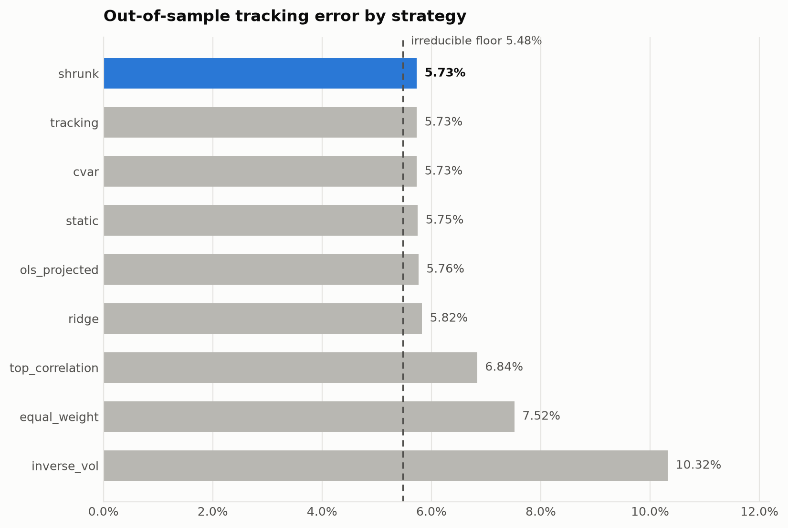
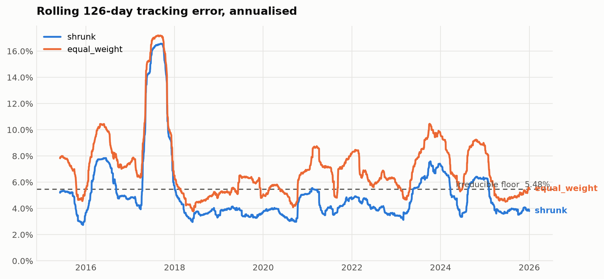
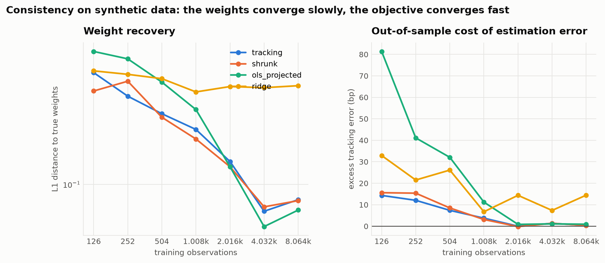
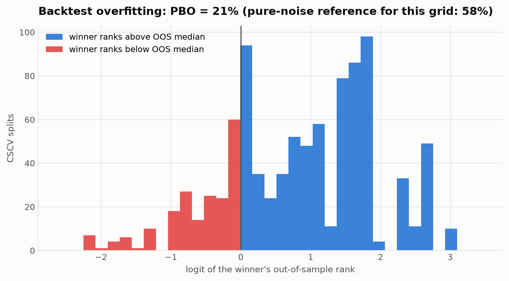
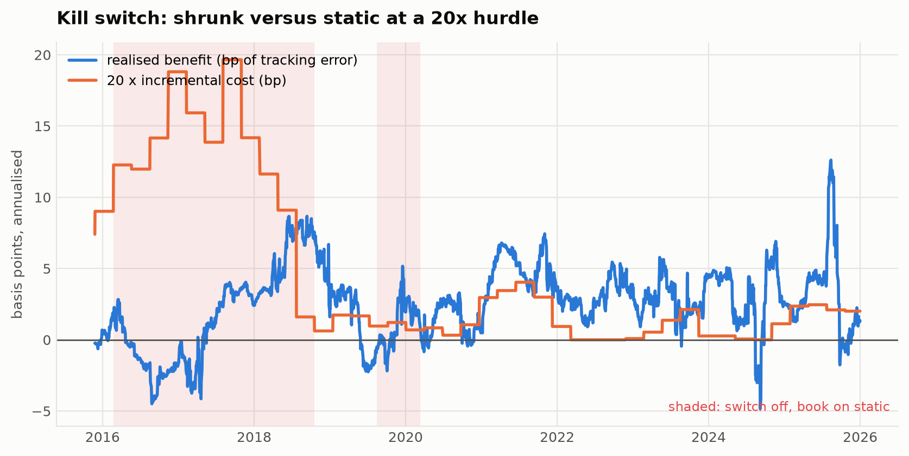
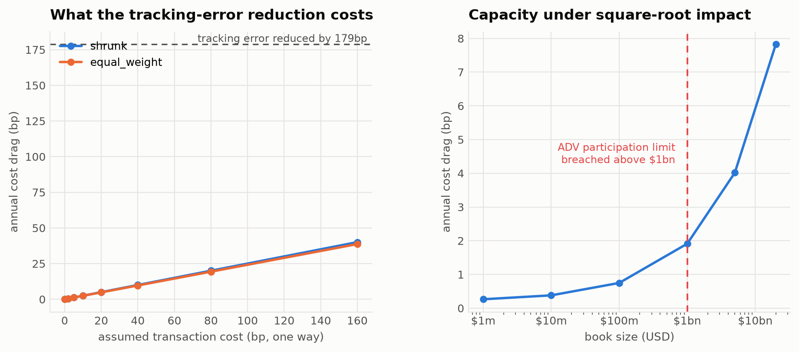
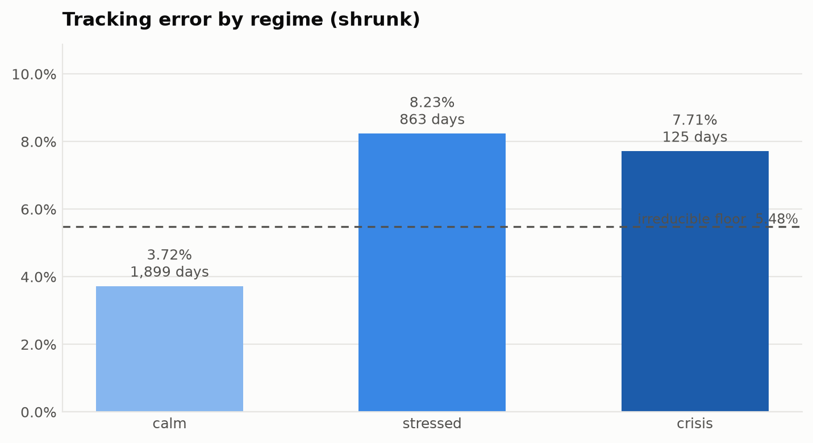

# ETF Replication Lab

[](https://github.com/khuper/etf-replication-demo/actions/workflows/ci.yml)


**Can a basket of liquid ETFs replicate a harder-to-access index — and does the optimisation actually earn its keep against a naive alternative?**

This repository answers that question the way it would have to be answered on a desk: every strategy on identical data, windows, constraints and costs; the difference tested rather than eyeballed; the result corrected for the fact that nine strategies were tried; and the whole thing reproducible from one command with no API key and no network.

The headline finding is not flattering to the machinery, which is why it is the headline:

> Constrained tracking-error optimisation beats an equal-weight basket by a wide and statistically significant margin — and is **indistinguishable from simply solving the problem once in 2015 and never trading again.** Held to a governance rule that a model must earn 20× its incremental cost or be switched off, the optimiser passes trivially against the naive basket and **fails against buy-and-hold: the rebalancing is shut off for 29% of the sample, and plain tracking-error minimisation ends the backtest shut off.** Of the three advertised constraints, the position cap does all the work; the turnover cap never binds and the CVaR budget binds once in forty-six.

```bash
pip install -e . && etf-lab study
```

That command runs the full workflow — data quality gates, a nine-strategy horse race with bootstrap confidence intervals, a weight-recovery study, a 54-configuration parameter sweep with overfitting diagnostics, cost and capacity analysis — and writes a self-contained HTML research memo. It takes about four minutes and needs nothing from the internet.

---

## Results

<!-- RESULTS-TABLE:START -->
| Strategy | Tracking error | Correlation | Down capture | Turnover / yr | vs. equal weight |
| --- | ---: | ---: | ---: | ---: | ---: |
| **shrunk** | 5.73% | 0.939 | 0.86 | 8.2% | -1.79% (significant) |
| tracking | 5.73% | 0.939 | 0.87 | 8.7% | -1.79% (significant) |
| cvar | 5.73% | 0.939 | 0.87 | 8.7% | -1.79% (significant) |
| static | 5.75% | 0.938 | 0.87 | 5.9% | -1.77% (significant) |
| ols_projected | 5.76% | 0.938 | 0.84 | 10.4% | -1.75% (significant) |
| ridge | 5.82% | 0.937 | 0.83 | 6.8% | -1.69% (significant) |
| top_correlation | 6.84% | 0.927 | 1.00 | 4.3% | -0.68% (significant) |
| equal_weight | 7.52% | 0.921 | 0.62 | 7.7% | benchmark |
| inverse_vol | 10.32% | 0.872 | 0.41 | 11.7% | +2.81% (worse) |
| _irreducible floor_ | _5.48%_ | _1.000_ | _--_ | _--_ | _the best any long-only basket of these candidates can do_ |

**Verdict.** Best out-of-sample tracking error: shrunk at 5.73% annualised, versus 7.52% for equal_weight. The market's irreducible tracking error -- the part no long-only basket of these assets can remove -- is 5.48%. shrunk therefore captures 88% of the available improvement over equal_weight, and sits +0.25% above the floor. That gap is statistically real: the 95% bootstrap interval for the tracking-error difference is [-2.19%, -1.44%] and Diebold-Mariano rejects equal expected squared tracking error (p = < 1e-16). Correcting for having run 9 strategies, the best result survives the multiple-comparison correction (Hansen SPA p = < 0.0005; White Reality Check p = < 0.0005). The simplest strategy that cannot be statistically separated from the winner is tracking (5.73%). On this evidence the extra machinery in shrunk is not doing measurable work.

**Overfitting.** Probability of backtest overfitting across 54 configurations: **24%**, against a matched pure-noise reference of 58%. Moderate: selection carries real risk.

**Consistency.** Weight error decays as T^-0.41 (parametric rate would be T^-0.50), reaching L1 = 0.083 at 8,064 observations. The out-of-sample cost of that estimation error falls to +0.3bp of tracking error above the true portfolio. The estimator is consistent, but the weights are far less identified than the fit is: collinear candidates leave the objective nearly flat in the directions that separate them, so a large weight error buys almost no extra tracking error. That is why weight stability and turnover get their own columns in the horse race.

<sub>Generated by `scripts/build_docs.py` from run `d9e91966b3762858` on synthetic data (fingerprint `8a1a5c8e7582afed`), 2,887 out-of-sample days. Reproduce with `make study`.</sub>
<!-- RESULTS-TABLE:END -->





---

## Why the default data is generated

The shipped experiment runs on a **simulated market**, not downloaded prices. That is a design decision with two reasons behind it, and it is stated up front because a reader deserves to judge it rather than discover it:

1. **It reproduces.** Same seed, same numbers, on any machine, forever. CI runs the entire research pipeline on every commit and checks the results digest — a claim that would be impossible against a live vendor feed, and a repo whose headline numbers the reader cannot regenerate is a screenshot.
2. **The answer is known.** The target is constructed as `w_true · r_assets` plus a component no candidate asset spans. So the population-optimal feasible portfolio *is* `w_true`, the minimum attainable tracking error *is* the volatility of the unspanned part, and an estimator can be scored on **whether it recovers the right answer** — not merely on whether it fits.

That second point is what real data cannot give you, and it is the difference between "this model tracked well on one history" and "this model is consistent":



The generator is not trying to be a market simulator. It is trying to be **hard in the ways that matter**: Student-t innovations, GARCH volatility clustering, a three-state Markov regime process with correlation breakdown in crises, a flight-to-quality leg that rallies when equities fall, and an irreducible residual. Everything is in [`etflab/data/synthetic.py`](etflab/data/synthetic.py), documented and seeded.

**Running on real prices is one flag**, and the identical pipeline:

```bash
etf-lab study --data-source yfinance --online --target PSP --start 2015-01-01 --end 2025-12-31
```

Conclusions about *this estimator versus that one* transfer to real data. Conclusions about the real PSP do not, and are not claimed anywhere in this repo.

---

## The parts worth looking at

### The look-ahead sentinel — [`tests/test_lookahead.py`](tests/test_lookahead.py)

Every claim this project makes is downstream of "no decision used information that did not exist yet". That is not verifiable by reading code — one misplaced index and the backtest becomes fiction that looks like a good result. So it is verified mechanically, two ways, for every strategy in the zoo:

- **Truncation.** Run on the full history, then on history truncated earlier. Every shared ledger row must be **bit-identical** (`atol=0, rtol=0`).
- **Future corruption.** Triple every price after a cut date and reverse the target's path. Every row before the cut must be unchanged.

A separate test covers the subtle case: the market-impact model needs a volatility estimate, and taking it from the period being traded into would price the trade with the future. Quadrupling volatility only after the cut must not change a single basis point of cost charged before it.

### Statistics that were validated, not just imported — [`etflab/inference.py`](etflab/inference.py)

Three problems get handled explicitly, because ignoring any one is how backtests come to be believed:

| Problem | Treatment | Validation in the test suite |
| --- | --- | --- |
| Serial dependence | Stationary bootstrap (Politis–Romano 1994), Newey–West HAC | Realised mean block length; interval coverage on an AR(1) |
| Comparing two strategies | Diebold–Mariano with the Harvey–Leybourne–Newbold correction | **Empirical size 5.4% at a nominal 5%**; power ≈ 100% against a 20% tighter competitor |
| Comparing nine strategies | White's Reality Check and Hansen's SPA | Size ≤ 5% under the null; SPA is never less powerful than the Reality Check |
| Selecting over a grid | Deflated Sharpe Ratio (Bailey–López de Prado 2014) | Rejects the best of 80 worthless trials; accepts a strong result from three |

A test that calls `diebold_mariano` and checks it returns a float verifies nothing about whether the test is a test. These check size and power by simulation.

### Overfitting priced in, against its own null — [`etflab/overfitting.py`](etflab/overfitting.py)

The parameter sweep runs 54 configurations and reports the best. Combinatorially Symmetric Cross-Validation (Bailey, Borwein, López de Prado & Zhu 2017) measures what that costs, over every balanced split of the sample.

One subtlety this repo handles that most implementations do not: **CSCV on a fixed sample does not have a clean 0.5 null.** Because the in-sample and out-of-sample halves partition one finite history, a configuration that ran hot in one has, mechanically, less luck left for the other. So the reported PBO is compared against a matched pure-noise reference of the same shape, averaged over replications — not against a textbook constant.



### The naive strategies are not strawmen — [`etflab/strategies.py`](etflab/strategies.py)

Nine strategies, one feasible set. An equal-weight or inverse-volatility target that would breach the position cap is *projected* onto the same constraint set the optimiser lives in, by the same Euclidean projection. A comparison where the fancy model gets constraints and the baseline does not is not evidence, it is a rigged demo.

`static` — solve once, never trade again — exists specifically to ask whether the rebalancing machinery is doing anything. On this data it is not.

### A kill switch, applied walk-forward — [`etflab/governance.py`](etflab/governance.py)

Every desk has a version of this rule and almost no backtest implements it: a model is allowed to run only while its realised out-of-sample benefit covers its realised incremental cost by a stated multiple (`--hurdle 20`), measured on a trailing window, with a grace period so a single bad month cannot switch off a decade-long edge. When it trips, the book reverts to the comparison strategy — paying the switching cost — and may re-earn its place.

The decision on day *t* uses ledger rows strictly before *t*, so the governed book is a strategy in its own right. It is evaluated three ways, and the three answers together are the point:

| Comparison | Outcome |
| --- | --- |
| vs. `equal_weight` | Never trips. The optimiser trades no more than the naive basket; there is nothing to pay for. |
| vs. the simplest indistinguishable strategy | Depends on the run — this is the reviewer's question. |
| vs. `static` (optimise once, hold) | **Trips four times and is off for 29% of the sample** for the winning estimator; plain `tracking` trips five times and ends the backtest shut off. The ongoing rebalancing does not earn 20× its cost. |



### Constraints that are checked for doing anything — [`etflab/diagnostics.py`](etflab/diagnostics.py)

Each constraint in the problem statement is tested at every rebalance for whether it binds, and the solver's dual is read to price what relaxing it would be worth. On this data the 25% position cap binds in 72–89% of rebalances depending on the estimator, and is the constraint doing the work. The 20% turnover cap (two-way L1, so 10% one way) never binds and on average a fifth of it is used — the low turnover in the results is a property of the estimator, not of the cap. The CVaR budget at a ratio of 1.0 binds once. Two of three advertised constraints are decoration, and the report says so.

### Costs that scale with the size of the book — [`etflab/costs.py`](etflab/costs.py)

A flat basis-point charge says trading $1bn costs the same per dollar as trading $1m. The `spread_impact` model adds half-spread plus square-root market impact against an assumed liquidity table, so "would you run this with real money, and how much?" becomes answerable:



Writing the tests found a real bug here: the flat model was charging on the halved reporting figure rather than on traded notional, so every cost was half what it should have been and the initial deployment out of cash was half again. [`tests/test_backtest.py`](tests/test_backtest.py) now pins both models against each other on an identical trade.

### Risk where it actually shows up



An average tracking error is a promise about a market that never happens. The report conditions on regime, on the target's worst days, and on its worst 21-day windows. The active-risk attribution uses a full Euler decomposition **including the target as a short leg** — the step usually skipped, and skipping it produces contributions that do not sum to the tracking error, so nobody can check them. Here they sum to it exactly, and [`tests/test_metrics.py`](tests/test_metrics.py) asserts it to nine significant figures.

---

## Reproducibility is a test, not an assurance

Every run writes a manifest containing the semantic config hash, a fingerprint of the actual price matrix, the git SHA and dirty flag, library and solver versions, and a digest of the numeric results.

`run_id` is a hash of **the experiment and the data — deliberately not the code.** If the SHA were in it, every commit would rename every run and the interesting question would become unanswerable. Keeping them separate makes it answerable:

```bash
etf-lab verify outputs/<run-id>
```

Two runs sharing a `run_id` are the same experiment. If their results digests differ, **the code changed the answer** — which is either a fix or a regression, and either way it should be loud rather than silent. CI runs that check on every commit, plus a second independent process to catch anything that leaked a wall clock or an unseeded generator into a research result.

```bash
etf-lab runs                         # everything in the registry
etf-lab diff <run-a> <run-b>         # what changed, and the first plausible explanation
```

---

## Command surface

| Command | What it does |
| --- | --- |
| `etf-lab study` | The full workflow: horse race, recovery, kill switch, constraint activity, sweep, costs, figures, HTML memo |
| `etf-lab compare` | Just the horse race, with confidence intervals and a generated verdict |
| `etf-lab run` | A single strategy backtest — the fastest path to a number |
| `etf-lab sweep` | Parameter grid with PBO and deflated Sharpe |
| `etf-lab validate` | Data quality gates only; exits non-zero if a blocking gate fails |
| `etf-lab verify <dir>` | Re-run a stored experiment and compare the results digest |
| `etf-lab runs` / `diff` | Query and compare the run registry |
| `etf-lab shell` | Interactive research terminal |

Every command takes `--json` and every command that produces a number also produces the provenance for it. There is no path through this CLI that prints a result you cannot later reproduce or audit.

---

## Architecture

```text
etflab/
├── config.py         ExperimentConfig — frozen, validated, content-hashed
├── data/
│   ├── synthetic.py  the generated market, and its ground truth
│   ├── providers.py  synthetic | yfinance | csv, behind one interface
│   ├── quality.py    nine gates that run before any weight is estimated
│   └── cache.py      content-addressed, human-readable
├── strategies.py     the model zoo, one shared feasible set
├── backtest.py       the walk-forward engine — the only place a decision date meets a return date
├── costs.py          flat bps, and half-spread + square-root impact
├── metrics.py        out-of-sample metrics, regimes, Euler risk attribution
├── inference.py      stationary bootstrap, Diebold–Mariano, Reality Check, SPA, deflated Sharpe
├── overfitting.py    CSCV → probability of backtest overfitting
├── governance.py     the kill switch: pay for itself 20× or revert, walk-forward
├── diagnostics.py    stress replay, tail conditioning, cost and capacity curves
├── research.py       orchestration, and the verdict generated from the statistics
├── provenance.py     run identity, code version, environment fingerprint
├── registry.py       an append-only index of every run
└── report/           terminal, figures, Markdown and self-contained HTML
```

Data quality gates are not optional decoration: `_load_checked_panel` is the only door into the data, a failing gate aborts the run, and `--allow-degraded` stamps the degradation into the manifest so nobody can later mistake the result for a clean one.

---

## What would break this

The numbers above are conditional on assumptions worth attacking directly:

- **The liquidity table is illustrative, not measured.** Half-spreads and ADVs are order-of-magnitude figures in [`etflab/costs.py`](etflab/costs.py). Replace them with real ones and re-run.
- **The market is simulated.** Its statistical features were chosen to be realistic, but they were *chosen*. The estimator comparison transfers; a claim about the real PSP does not.
- **The candidate universe is fixed and hand-picked.** In the synthetic setting the true portfolio is inside the candidate set by construction. On real prices it might not be, and choosing today's surviving ETFs is survivorship bias that flatters every number.
- **No borrow, financing, creation/redemption friction, or tax.** Small for a long-only fully-invested book, but omissions.
- **Execution is modelled at the close.** Intraday slippage and the timing risk of working a large order over days are not charged for.
- **The target is unlevered by construction.** Setting `--leverage 1.4` puts the true portfolio outside the feasible set, which is closer to the real problem of replicating a levered private-equity proxy with unlevered ETFs — and the tracking error roughly doubles.

---

## Development

```bash
make install-dev
make check          # ruff + mypy + the full suite, exactly what CI runs
make study          # run the shipped experiment
make figures        # regenerate docs/figures and the results table above
make verify         # re-run the latest study and check the digest
```

230 tests, no network required. The suite is structured around the claims rather than the modules: [`test_lookahead.py`](tests/test_lookahead.py) defends point-in-time correctness, [`test_reproducibility.py`](tests/test_reproducibility.py) defends run identity and determinism, [`test_inference.py`](tests/test_inference.py) validates the statistics by simulation, [`test_governance.py`](tests/test_governance.py) proves the kill switch trips when it should and never looks ahead, and [`test_backtest.py`](tests/test_backtest.py) pins the engine arithmetic against hand computations.

Further reading: [`docs/methodology.md`](docs/methodology.md) for the walk-forward protocol and the estimators, and [`docs/decisions.md`](docs/decisions.md) for the design choices and what was rejected.

## License

[MIT](LICENSE).
