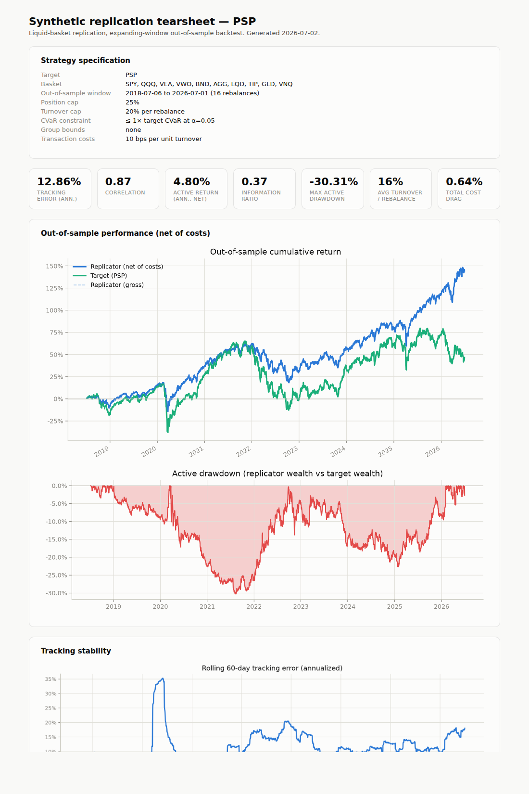
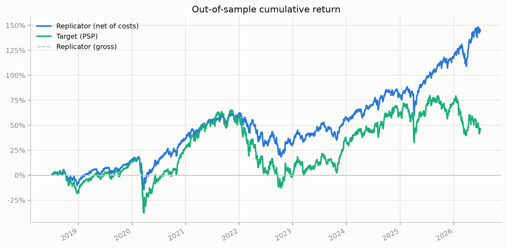
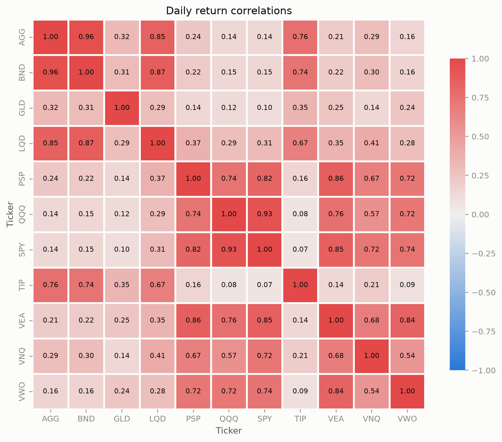

# Synthetic ETF Replicator


Build a **liquid ETF basket that tracks an illiquid target** as closely as possible, and get a
committee-ready answer to the question that actually matters: *how well does it track, out of
sample, net of costs?*

The package downloads market data with `yfinance`, solves a constrained tracking-error
optimization with CVXPY, runs an expanding-window backtest with transaction costs, and renders a
self-contained **HTML tearsheet** with headline metrics, consistency evidence, stress-window
behavior, and cost sensitivity. The default target is `PSP` (a comparatively illiquid
private-equity ETF) replicated with a basket of ten liquid ETFs.



## Install

```bash
git clone https://github.com/khuper/etf-replication-demo
cd etf-replication-demo
python -m venv .venv && source .venv/bin/activate   # Windows: .venv\Scripts\activate
pip install -e .
```

## Quickstart

```bash
# Replicate PSP with the default liquid basket (10 years of history)
etf-replicate

# Rolling correlation diagnostics for the basket
etf-correlations
```

Everything is written to `outputs/`:

| File | What it is |
| --- | --- |
| `tearsheet.html` | Self-contained strategy tearsheet (open in any browser, share as a file) |
| `backtest_metrics.csv` | Gross and net headline metrics |
| `weights_history.csv` | Allocation at every rebalance |
| `full_sample_weights.csv` | "Ideal today" allocation using all history |
| `*.png` | Every chart individually (cumulative returns, drawdown, rolling tracking, allocation, correlations) |

## Configure it from the command line

All parameters are flags — no code edits needed:

```bash
etf-replicate \
  --target PSP \
  --assets SPY QQQ VEA VWO BND AGG LQD TIP GLD VNQ \
  --start 2019-01-01 \
  --max-weight 0.25 \
  --max-turnover 0.20 \
  --cost-bps 10 \
  --step 126
```

### Express preferences about what you trade

Every basket ticker carries an instrument-type tag (`equity`, `fixed_income`, `commodity`,
`real_estate`, …). Group bounds constrain how much of the portfolio each type may hold, so the
basket reflects what you are actually willing to trade:

```bash
# Keep equities between 20% and 60%, hold no commodities at all
etf-replicate --group-bound equity=0.2:0.6 --group-bound commodity=0:0

# Pin fixed income to exactly 30% (min = max is a hard target)
etf-replicate --group-bound fixed_income=0.3:0.3

# Tag your own tickers, then bound the group
etf-replicate --assets SPY QQQ DBC GLD BND --asset-class DBC=commodity --group-bound commodity=0:0.15
```

Infeasible combinations (e.g. group minimums that sum past 100%) are rejected with a clear error
before any optimization runs.

## Method

```text
yfinance prices
  -> daily returns
  -> CVXPY: min Σ (basket return − target return)²
       s.t. fully invested, long-only
            per-position cap
            portfolio CVaR ≤ ratio × target CVaR
            L1 turnover cap per rebalance
            instrument-type group bounds
  -> expanding-window backtest (rebalance every `step` days, costs on turnover)
  -> metrics + tearsheet
```

The backtest avoids look-ahead bias: each rebalance is optimized only on data available at that
date, and returns are measured strictly after it. Turnover is computed against drift-adjusted
previous weights, transaction costs (`--cost-bps` per unit of L1 turnover) are charged on each
rebalance day, and the first rebalance pays for a full deployment from cash.

The tearsheet reports what a strategy reviewer would ask for:

- **Headline tiles** — annualized tracking error, correlation, information ratio, active return,
  max active drawdown, average turnover, total cost drag (all net of costs)
- **Consistency** — monthly active-return grid with a hit rate (share of months tracking within
  ±50 bps), best/worst months
- **Stress windows** — replication quality inside the COVID crash and the 2022 rate shock
- **Cost sensitivity** — the same headline metrics at 0 / 10 / 25 bps, so results aren't an
  artifact of the cost assumption



## Correlation diagnostics

`etf-correlations` analyzes how each basket ETF's correlation to the target behaves over time and
inside historical stress windows — if correlations spike toward 1 in a crash, diversification
inside the basket disappears exactly when replication matters most. It saves per-asset statistics
(`correlation_stats.csv`), a small-multiples grid, and a mean-correlation chart:



## Use it as a library

```python
from etf_replicator import fetch_prices, to_returns, run_expanding_backtest, summarize_backtest

prices = fetch_prices(["SPY", "QQQ", "GLD", "PSP"], "2020-01-01", "2025-01-01")
returns = to_returns(prices)
result = run_expanding_backtest(returns, ["SPY", "QQQ", "GLD"], "PSP", cost_bps=10)
print(summarize_backtest(result).round(4))
```

## Project layout

| Module | Purpose |
| --- | --- |
| [`config.py`](src/etf_replicator/config.py) | Run configuration, instrument-type tags, group-bound validation |
| [`data.py`](src/etf_replicator/data.py) | Market data download and return computation |
| [`optimizer.py`](src/etf_replicator/optimizer.py) | CVaR/turnover/group-constrained tracking-error optimization |
| [`backtest.py`](src/etf_replicator/backtest.py) | Expanding-window backtest with transaction costs |
| [`metrics.py`](src/etf_replicator/metrics.py) | Tracking error, information ratio, drawdowns, consistency stats |
| [`report.py`](src/etf_replicator/report.py) | Self-contained HTML tearsheet |
| [`correlations.py`](src/etf_replicator/correlations.py) | Rolling correlation analysis across stress periods |
| [`stress.py`](src/etf_replicator/stress.py) | Beta-based regime-shift stress test |
| [`plotting.py`](src/etf_replicator/plotting.py) | All chart generation |
| [`cli.py`](src/etf_replicator/cli.py) | `etf-replicate` and `etf-correlations` entry points |

## Testing

```bash
python -m unittest discover -s tests -v
```

The suite runs fully offline (market data is mocked, backtests use synthetic returns) and covers
the optimizer constraints, backtest accounting, metrics, stress test, and tearsheet generation.
CI runs it on every push and pull request.

## Limitations

Still a research demo, not a production trading system:

- market data comes from `yfinance`, which is convenient but not institutional-grade
- transaction costs are a flat rate on turnover — no market impact or bid/ask spread modeling
- the beta stress test is intentionally simple (historical stress *windows* in the tearsheet are
  the more informative view)
- weights are assumed to be held at the rebalance target between rebalances

## License

Released under the [MIT License](LICENSE).
